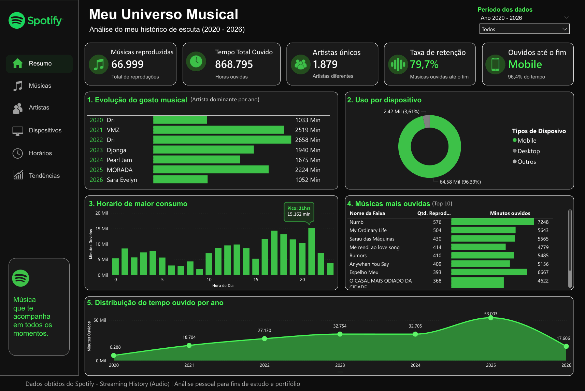

# 🎧 Spotify Streaming History Analysis (2020 - 2026)

Análise do meu histórico pessoal de streaming do Spotify, transformando dados brutos em insights visuais através de uma pipeline completa de dados.

Este projeto combina:

- Engenharia e tratamento de dados com Python
- Modelagem analítica
- Visualização e storytelling com Power BI

---

# 📌 Objetivo

Transformar meu histórico de escuta do Spotify em um dashboard interativo capaz de responder perguntas como:

- Em quais horários escuto mais música?
- Meu consumo acontece mais no celular ou desktop?
- Como meu gosto musical evoluiu ao longo dos anos?
- Quais artistas possuem maior retenção?
- Em quais anos ouvi mais música?

---

# 🛠 Tecnologias utilizadas

- Python
- Pandas
- Jupyter Notebook
- Power BI
- Git / GitHub

---

# 📂 Estrutura do projeto

```bash
spotify-stream-analysis/
│
├── data/
│   ├── sanitized/          # JSONs tratados (sem dados sensíveis)
│   └── processed/          # Dataset final para BI
│
├── notebooks/
│   └── spotify_analysis.ipynb
│
├── dashboard/
│   └── spotify_dashboard.pbix
│
├── images/
│   └── dashboard-preview.png
│
├── README.md
└── requirements.txt
```

---

# 🔄 Pipeline do projeto

## 1. Extração dos dados

Os dados foram exportados diretamente do Spotify através do histórico de streaming.

Formato original:

- Múltiplos arquivos JSON
- Dados entre 2020 e 2026

---

## 2. Sanitização de dados

Como se trata de dados pessoais, campos sensíveis foram removidos antes da publicação.

Campos removidos:

- `ip_addr`

Objetivo:

Garantir privacidade e permitir publicação segura do projeto.

---

## 3. Transformação com Python

Durante o processamento, foram criadas novas variáveis analíticas:

### Features criadas:

- Ano
- Mês
- Hora
- Tipo de dispositivo
- Tempo reproduzido em minutos
- Status de retenção

Também foram realizados:

- Tratamento de nulos
- Padronização de formatos
- Consolidação de múltiplos arquivos

---

## 4. Modelagem no Power BI

Após o processamento, os dados foram exportados para CSV e modelados no Power BI com:

- Tabela calendário
- Medidas DAX
- KPIs analíticos
- Dashboard interativo

---

# 📊 Dashboard

## Visão geral



---

# 🔍 Principais insights

## 🎵 1. Evolução musical ao longo dos anos

Meu artista dominante mudou em praticamente todos os anos analisados, mostrando forte diversidade musical.

Exemplo:

- 2020 → Dri
- 2021 → VMZ
- 2022 → NEFFEX
- 2023 → Djonga
- 2024 → Pearl Jam
- 2025 → MORADA
- 2026 → Sara Evelyn

---

## ⏰ 2. Pico de consumo

Meu horário de maior consumo ocorre às:

### 21h

Indicando preferência por ouvir música no fim do dia.

---

## 📱 3. Dispositivo principal

Mais de:

### 96% do consumo

acontece em dispositivos mobile.

---

## ❤️ 4. Retenção musical

Alguns artistas apresentam taxa de retenção superior a:

### 98%

Indicando forte conexão musical.

---

# 📈 KPIs analisados

- Total de reproduções
- Tempo total ouvido
- Artistas únicos
- Taxa de retenção
- Dispositivo principal
- Distribuição anual

---

# 🚀 Como executar

## Clone o repositório

```bash
git https://github.com/ViniAnjos84/AnaliseDeDados-SpotifyStreaming
```

## Instale as dependências

```bash
pip install -r requirements.txt
```

## Execute o notebook

Abra:

```bash
notebooks/spotify_analysis.ipynb
```

---

# 💡 Aprendizados

Durante este projeto, pratiquei:

- Engenharia de dados
- Tratamento de dados reais
- Privacidade e sanitização
- Modelagem analítica
- Storytelling com dados

---

# 👨‍💻 Autor

**Vinicius Anjos**

Projeto desenvolvido para fins de estudo, portfólio e evolução profissional em dados.